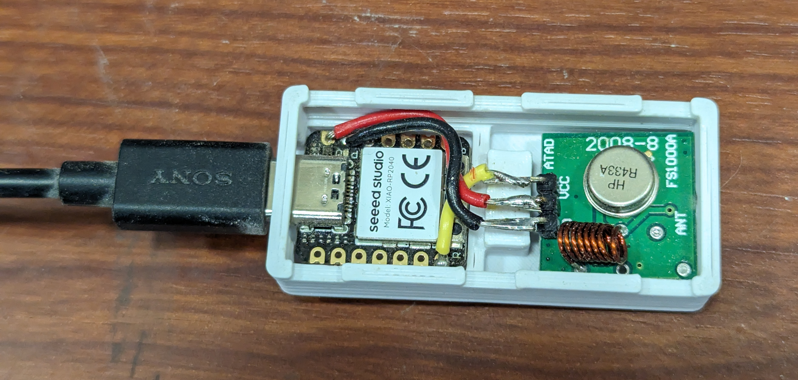
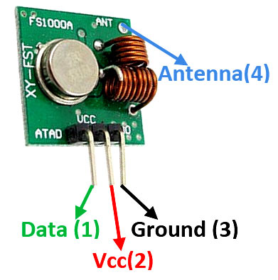
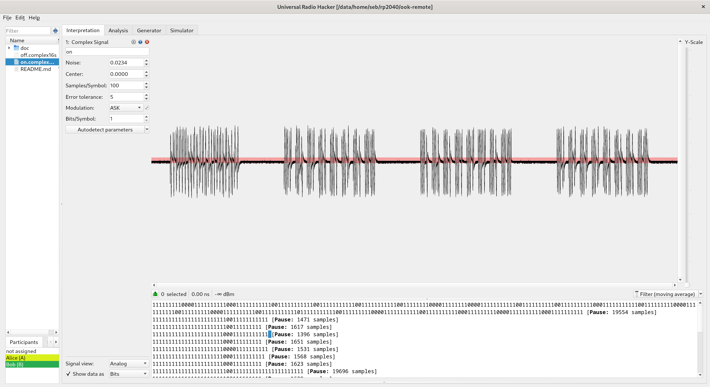
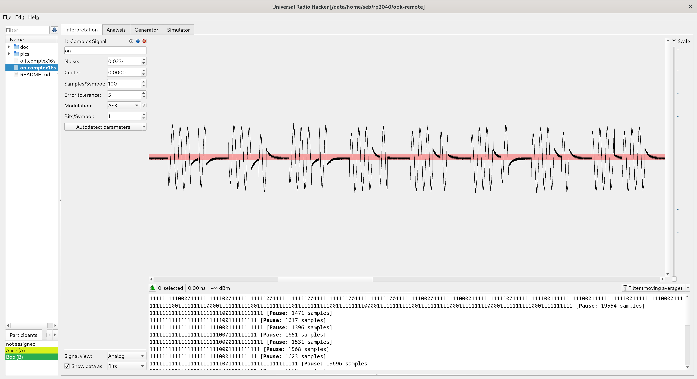
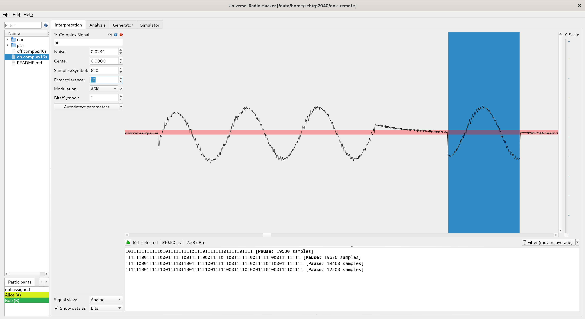
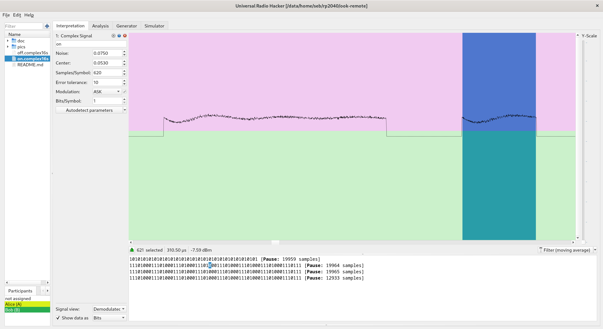
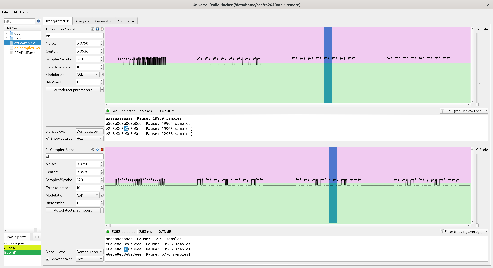

# Introduction

This is a minimal effort transmitter for 433 MHz On-Off Keyed/Amplitude
Shift Keyed remote control signals.



It's built using a Seeed Studios XIAO RP2040 and a FS1000A (433 MHz
ASK transmitter).

* <https://wiki.seeedstudio.com/XIAO-RP2040/> 

* <https://components101.com/modules/433-mhz-rf-transmitter-module>


Some versions of the FS1000A use two coil inductors (as pictured above),
and some use just one coil and one surface mount inductor on the back
of the board.  I think both versions should work just fine.


# Wiring

If you intend to use the enclosure, make sure to route the wires so
they don't interfere with the "clamp" that holds the Xiao RP2040 board
in place.

Super simple wiring:

```
Xiao RP2040      | FS1000A
-----------------+--------
Vbus/5V          | Vcc
GND              | GND
GPIO0 (P0/TX/D6) | ATAD
```

The antenna is optional, for me it worked fine without.  If you want one,
solder a 1/4 wave antenna (173 mm of wire) to the FS1000A antenna via.
NOTE: Carefully select the correct hole for this, as the silkscreen on
these cheap boards is all over the place.


# Reverse engineering the original remote's signal

The immediate goal is to clone the remote for a WEN 3410 air filter
(<https://wenproducts.com/products/Air-Filtration-System-Item-3410>).

I used a HackRF One (<https://greatscottgadgets.com/hackrf/one/>) and
GQRX to find the frequency of the original remote.

I then used `hackrf_transfer` to record the signals sent by the "on"
and "off" buttons:

Capture:

```
$ hackrf_transfer -s 2000000 -f 433920000 -r on.complex16
$ hackrf_transfer -s 2000000 -f 433920000 -r off.complex16
```

Replay:

```
$ hackrf_transfer -s 2000000 -f 433920000 -a1 -x24 -t on.complex16
$ hackrf_transfer -s 2000000 -f 433920000 -a1 -x24 -t on.complex16
$ hackrf_transfer -s 2000000 -f 433920000 -a1 -x24 -t on.complex16
$ hackrf_transfer -s 2000000 -f 433920000 -a1 -x24 -t off.complex16
```


## Demodulating with Universal Radio Hacker

I used Universal Radio Hacker (URH, <https://github.com/jopohl/urh>) to
analyze the recorded signals.  URH needs the filename extensions to be
`.complex16s`.

This is what the remote sends when I click the "On" button.  We can see
one "header" burst, followed by three similar-looking burst:



Zooming in on the second burst we can see the On-Off Keying, where the
constant-frequency carrier wave is sometimes transmitted and sometimes
not:



Zooming in more and selecting what looks like a single symbol/bit we
get an approximate symbol size of 621 samples, or 310 microseconds:



I then switched to the demodulated signal view and adjusted the noise
and center to clean up the decoding.  This is starting to look good:



Loading the "off" signal, demodulating it in the same way, and comparing
them.  We see that there's a small difference in the middle of the
data burst:




# FS1000A radio info


## Modulation theory

On-Off Keying: <https://en.wikipedia.org/wiki/On%E2%80%93off_keying>

Amplitude Shift Keying: <https://en.wikipedia.org/wiki/Amplitude-shift_keying>


## Radio tranceiver

* Martyn Davies' excellent explanation of ASK,
  OOK, and the FS1000A/XY-MK-5V transceiver:
  <https://www.youtube.com/watch?v=w6V9NyXwohI>

* <https://theorycircuit.com/fs1000a-433mhz-rf-transmitter-and-receiver-brief-note/>


# Other similar projects & info

* <http://www.ignorantofthings.com/2018/11/reverse-engineering-433mhz-remote.html>

* <https://forums.raspberrypi.com/viewtopic.php?t=58420>

* <http://www.hoagieshouse.com/RaspberryPi/RCSockets/RCPlug.html>


## Alternative radio

The FS1000A is the simplest radio transmitter imaginable, and inexpensive.

It's tempting to build a much more capable radio toy, perhaps using
the [CC1101](https://www.ti.com/product/CC1101) (available on ebay,
$10 board including SMA connector and antenna).

CC1101 based project: <https://github.com/mcore1976/cc1101-tool>
